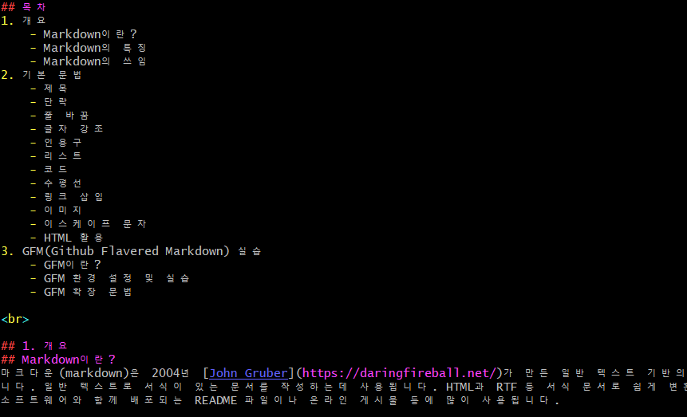
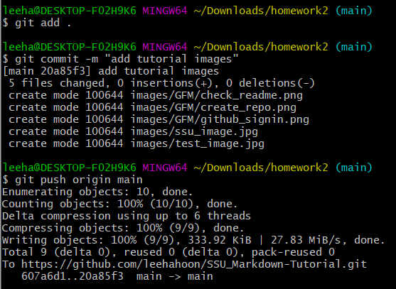

## 과제2. (git & github 학습하기)
### 컴퓨터학부 / 소프트웨어공학 / 20182650 / 장재훈

https://github.com/leehahoon/SSU_Markdown-Tutorial  

***

## 목차  
1. Github Repository 생성
2. git 설정
    1. git config
3. git 새 저장소 만들기
    1. git init
4. 파일 commit 하기
    1. git status
    2. git add
    3. git commit
    4. git log
5. 원격 저장소 관리하기
    1. git remote
    2. git push
    3. git clone
    4. git pull
6. 브랜치
    1. git branch
    2. git checkout
    3. git merge
    4. git rebase
7. 태그 및 기타 명령어
    1. git tag
    2. git reset
8. 명령어 목록 표

<br>

## 1. Github Repository 생성

먼저, "Markdown 튜토리얼 만들기" 프로젝트를 깃허브에서 버전관리 하기위해 Repository 먼저 생성하겠습니다.


오른쪽 위에 "New repository" 버튼을 클리하여 새로운 repo를 생성합니다.  
  
<br>


"Repository name"을 원하는 이름(해당 프로젝트의 경우, "SSU_Markdown-Tutorial"로 설정)으로 작성합니다. 여러 옵션을 선택할 수 있는데 저는 접근 권한은 "Public"으로 설정했습니다.

<br>


새로운 repository가 생성된 것을 확인할 수 있습니다.

<br>

## 2. git 설정  

### 2-1. git config
본격적으로 git을 사용하기전에, `git config` 명령어를 이용하여 계정에 대한 정보를 설정하겠습니다. (기본적으로 git은 설치했다고 가정합니다.) 현재, 새로운 repository는 만들었지만 어떤 사용자가 어떤 원격 저장소에 연결하여 버전관리하는지 모르기때문에 사용자가 설정을 해야합니다. 기본 환경설정을 하여 git을 이용할 수 있게 할 것입니다.

```
$ git config --global user.name "[사용자명]"
$ git config --global user.email "[메일주소]"
$ git config --list
```

위의 명령어는 각각 git의 사용자명과 메일 주소를 설정하는 구문입니다. `--global` 옵션을 붙이면 해당 시스템에서 모든 git 프로젝트는 설정한 사용자명과 메일 주소를 사용하게 됩니다. 만약, 프로젝트마다 다르게 주고 싶다면 global 옵션을 제거하면 됩니다. `git config --list`는 등록된 설정을 확인하는 명령어입니다.

계정 설정 이외에도, git의 출력 메시지 색상을 변경하거나 단축키를 설정할 수 있습니다. 

```
$ git config --global color.ui auto       //출력 메시지 색상 변경
$ git config --global alias.co checkout   //'checkout' 명령어를 'co'로 생략
```

자주 사용할 것 같은 것은 `user.name`과 `user.email`로 기본적인 계정정보를 설정하는 것과 git 설정을 확인할 수 있는 `git config --list`로 설정 정보를 자주 볼 것 같습니다.


<br>

## 3. git 새 저장소 만들기

### 3-1. git init
git에 대한 기본적인 정보를 `git config` 명령어를 통해 이미 설정을 완료한 상태입니다. "1. Github Repository 생성"에서 원격에 저장소는 만들었고, 이제 로컬 환경의 저장소를 만들 것입니다. 원하는 폴더에서 `git init` 명령어를 통해 일반 폴더에서 로컬 저장소로 초기화합니다.


<br>

## 4. 파일 commit 하기

### 4-1. git status
이전에 `git init` 명령어로 로컬 환경의 저장소로 초기화했습니다. 이제 현재 저장소에 `markdown_tutorial.md`라는 만들어 파일의 추가 사항을 기록할 것입니다. 다음과 같이 작성한 파일을 초기화한 로컬 저장소 환경에 저장합니다.

```
안녕하세요, 이 파일은 마크다운 튜토리얼입니다.
```

원격 저장소에 올리기 전, 어떤식으로 로컬 저장소에서 원격에 저장되는지 알아보겠습니다. 우리가 흔히 말하는 폴더/디렉터리를 Git에서는 `작업 트리(Work Tree)`라고 부릅니다. 파일이나 폴더의 추가/변경 사항을 저장소에 기록하려는 것을 `커밋(commit)`이라고 부릅니다. 커밋을 하면 이전 커밋 상태부터 현재 상태까지의 변경 이력이 기록된 커밋이 만들어집니다. 그리고 커밋을 실행하기 전의 저장소와 작업 트리에 존재하는 공간을 `인덱스(Index)`라고 합니다.
  
우리는 현재 파일들의 상태를 확인할 것입니다. 간단히 설명한다면, 파일이 위에서 언급한 작업 트리에 있는지, 인덱스에 있는지를 확인할 수 있습니다.

```
$ git status
```


현재, `markdown_tutorial.md` 파일을 추가하고 아무런 작업을 하지 않은 상태입니다. 위의 실행화면을 보면 "No commits yet"이라고 아직 커밋하지 않을 것을 알 수 있고 `Untracked files:`라고 우리가 추가한 파일이 나옵니다. "Untracked"는 파일의 저장소에 저장할 필요가 없어 git이 신경쓰지 않아도 되는 상태를 의미합니다. `git status` 명령어을 통해 파일이 어떤 상황인지 알 수 있으므로 추후에 배울 add, commit 이후에 변경된 파일의 상태도 확인할 수 있습니다.


### 4-2. git add
이전의 `git status` 명령어로 "markdown_tutorial.md" 파일이 untracked files 인 것을 확인했습니다. 이제, 해당 파일을 인덱스라고 하는 공간에 등록(stage, 스테이징 한다고도 표현)할 것입니다. 즉, 파일 및 폴더의 추가, 변경 사항을 저장소에 기록하는 준비를 하는 것입니다. `git add [파일명]`을 통해 추가할 수 있습니다.

```
$ git add markdown_tutorial.md  //"markdown_tutorial.md" 파일 추가
$ git add .                     //현재 폴더의 모든 파일을 추가
```

`git add` 명령어로 대상 파일을 추가하고 `git status` 파일로 저장소 상태를 확인하면 다음과 같이 나옵니다.


이전과 다르게, 초록색 글씨로 "markdown_tutorial.md" 파일이 추가된 것을 확인할 수 있습니다.

  
### 4-3. git commit
이제 최종적으로 변경이력을 기록하겠습니다. 현재, `git add` 명령어를 통해 인덱스에 "markdown_tutorial.md" 파일이 등록되어 있습니다. `git commit` 명령어로 저장소에 이력을 남깁니다.

```
$ git commit -m [메시지]
```

`git commit` 명령어를 사용할 때는, `-m` 옵션을 반드시 붙여야합니다. 이는 커밋하여 이력을 남길 때, 메시지를 남기는 것입니다. 메시지는 다른 사람이 커밋 이력을 확인할 때 이해하기 쉽게 남기는 것이 좋습니다. 저는 파일을 추가한 상황이므로, 간단하게 "add markdown_tutorial.md"라고 작성했습니다.


명령어를 실행 이후, `git status` 명령어로 현재 저장소의 상황을 확인하면 모든 변경사항이 커밋이 완료된 것을 확인할 수 있습니다. 앞으로 로컬 상황에서 프로젝트 작업을 하고 변경이력을 기록할 때, 아래와 같이 명령어를 실행하여 커밋하면 됩니다.

```
$ git add [파일명]          //인덱스에 파일 추가
$ git commit -m [메시지]    //저장소에 이력 기록
```

### 4-4. git log
`git commit` 명령어를 통해 최종적으로 변경 이력을 저장소에 남겼습니다. 만약, 해당 저장소의 commit 히스토리를 보고싶다면, `git log` 명령을 실행하면 됩니다. 가장 최근의 커밋이 나오고, 이어서 각 커밋의 SHA-1 Checksum, 저자 이름, 이메일, 커밋 날짜, 커밋 메시지 등의 정보를 출력합니다. `--decorate` 옵션을 이용하면 밑에서 배울 태그 정보를 포함하여 이력을 확인할 수 있습니다.

```
$ git log
$ git log --decorate    //태그 정보를 포함한 이력 확인
```


## 5. 원격 저장소 관리하기

### 5-1. git remote
지금까지, 내 PC의 로컬 저장소에서 커밋을 통해 이력을 변경했습니다. 이제부터는 원격 저장소를 이용하여 로컬 저장소의 변경 이력을 공유하는 방법에 대해 알아 보겠습니다. 

내 PC에서 `git commit` 명령을 통해 변경된 이력을 원격 저장소와 공유하려면, 로컬 저장소의 변경 이력을 원격 저장소에 업로드해야 합니다. 이를 위해, 원격 저장소의 정보를 추가할 것입니다. 만약 해당 작업을 하지 않으면 원격 저장소에 변경 이력을 공유할 때마다 긴 원격 저장소의 주소를 입력해야할 것 입니다. `git remote` 명령어를 이용해 원격 저장소의 정보를 추가하는데 다음과 같이 사용합니다.

```
$ git remote add [이름] [원격저장소 url]    //원격 저장소의 정보 추가
$ git remote        //로컬 저장소에 연결된 원격 저장소의 정보 출력(-v 옵션도 사용 가능)
```

현재, 공유할 원격 저장소의 url은 `https://github.com/leehahoon/SSU_Markdown-Tutorial.git` 입니다. 그래서 다음과 같은 명령어를 입력했습니다.

```
$ git remote add origin https://github.com/leehahoon/SSU_Markdown-Tutorial
```

[이름] 부분의 `origin`은 origin이라는 이름으로 원격 저장소가 등록되었다는 의미입니다. 콘솔의 경우, 밑에 나올 push나 pull 명령어 사용 시에 원격 저장소명을 생략하면, origin이라는 이름의 원격 저장소를 사용합니다. 따라서, 여기서도 `origin`이라는 이름의 원격 저장소를 등록했습니다.


`git config --list` 명령어를 통해 설정을 확인해보면 `remote.orgin.url`이 설정한 원격 저장소로 변경된 것을 확인할 수 있습니다. 


또한, `git remote -v` 명령을 통해 원격 저장소의 url도 확인할 수 있습니다. 만약, 현재 로컬 저장소와 공유되는 원격 저장소의 정보를 알고 싶을 때 `git remote -v`를 사용하면 될 것 같습니다.


### 5-2. git push
현재 상황은 로컬 저장소의 변경 이력을 원격 저장소에 업로드하기 위해 원격 저장소의 정보를 로컬 저장소에서 `git remote` 명령어를 이용해 추가한 상태입니다. 이제 내 PC에서 변경된 이력을 원격 저장소와 공유하려면, 로컬 저장소의 변경 이력을 원격 저장소에 업로드해야 합니다. git에서는 원격 저장소로 변경된 파일을 업로드하는 것을 `push`라고 합니다. 이 push를 위한 명령어는 `git push` 입니다.

```
$ git push [저장소명] [브랜치명]    //[저장소명]에 [브랜치명]으로 push
$ git push origin main
```

origin은 위에서 말한대로 remote(원격 저장소)의 주소를 뜻합니다 브랜치명은 아래에서 배우겠지만, 어떤 사용자(브랜치)가 올리는지를 적습니다. 이 예제에서는 main이라는 브랜치로 푸시 했습니다.

`git push` 명령은 이 밖에도 여러 옵션이 있습니다. 원래는 매번 저장소명과 브랜치명을 입력해야 하지만 `git push -u`, push에 -u 옵션 적어주면 최초에 한 번만 입력하고 이후에는 인자 생략이 가능해집니다.

`git push -f` 명령을 사용하면 원격 저장소 내의 코드 변경 이력을 로컬 저장소의 코드 변경 이력으로 덮어씁니다. 일단 원격 저장소에 코드 변경분을 올린 이후에는 더 이상 해당 코드 변경분은 순전히 자신의 코드가 아니기 때문에 함부로 변경 이력을 수정하면 안 됩니다. 왜냐하면 동료가 해당 코드 변경분을 내려 받았는데, 내가 그 코드 변경 이력을 수정해서 다시 올리면, 그 동료에게 코드 충돌이 발생할 것이기 때문입니다. 그래서, 원격 저장소에 올린 코드 변경분은 절대 덮어쓰지 않는 것이 원칙입니다.

아래는 콘솔에서 `git push origin main` 명령을 사용하여 원격 저장소에 변경이력을 공유하는 사진입니다.


`git push origin main` 명령어 이후에, 우리가 설정한 원격 저장소로 가보면, 로컬 저장소에서 추가했던 markdown_tutorial.md 파일이 추가된 것을 확인할 수 있습니다.


### 5-3. git clone
`git push` 명령을 사용하여 로컬 저장소의 내용을 원격 저장소에 공유했습니다. 만약, 다른 프로젝트 팀원이 이 원격 저장소를 본인의 PC에 가져와서 로컬 저장소로 사용하고 싶다면 어떻게 해야할까요? `git clone` 명령어를 이용하면 됩니다. 이 명령을 사용하면 원격 저장소를 복제하여 원격 저장소의 내용을 통째로 다운로드합니다. 

```
$ git clone [원격저장소] [디렉터리]     //[원격저장소]를 [디렉터리]에 복제하여 저장
```

`git clone` 명령에서 [디렉터리]는 생략 가능합니다. 생략 시, 원래 원격 저장소의 명으로 복제됩니다. 이 명령어는 언제 사용하는지 쉽게 이해하기 위해 다음과 같은 상황을 예로 들겠습니다.
일단, 제가 먼저 "SSU_Markdown-Tutorial" 이라는 원격 저장소를 만들고 "markdown_tutorial.md"라는 파일을 원격 저장소에 올렸습니다. 이제 다른 팀원은 이 markdown_tutorial.md 파일의 내용을 추가할 것입니다. 그러기위해서 원격 저장소의 내용을 자신의 PC에 저장해서 로컬 저장소로 사용할 것입니다. 이때, `git clone`이라는 명령어를 사용하는 것입니다.

이와 같은 명령을 이용하기 위해 `git clone https://github.com/leehahoon/SSU_Markdown-Tutorial.git` 명령을 실행합니다.


명령어를 입력하고, `markdown_tutorial`이라는 이름의 디렉터리로 원격 저장소의 내용을 저장한 것을 확인할 수 있습니다. 원격 저장소에 있는 "markdown_tutorial.md" 파일도 위에서 push 한 내용대로 그대로 있는 것을 알 수 있습니다.

이번에는 다른 사용자가 해당 파일을 수정하여 푸시한다고 생각해보겠습니다. 해당 팀원은 markdown_tutorial.md 파일의 대략적인 구조를 잡기위해 다음과 같이 목차 부분을 추가했습니다. 

```
## 목차  
1. 개요
    - Markdown이란?
    - Markdown의 특징
    - Markdown의 쓰임
2. 기본 문법
    - 제목
    - 단락
    - 줄 바꿈
    - 글자 강조
    - 인용구
    - 리스트
    - 코드
    - 수평선
    - 링크 삽입
    - 이미지
    - 이스케이프 문자
    - HTML 활용
3. GFM(Github Flavered Markdown) 실습
    - GFM이란?
    - GFM 환경 설정 및 실습
    - GFM 확장 문법
```

위에서 배운대로, 차례차례 명령어를 입력하여 수정한 파일을 원격 저장소에 공유하겠습니다.

```
$ git add markdown_tutorial.md                          //변경된 markdown_tutorial.md 파일 추가
$ git commit -m "Add tutorial's table of contents"      //로컬저장소에 이력 기록 
$ git push origin main                                  //원격저장소와 공유
```

해당 명령어를 입력한 후, 원격 저장소에 목차의 내용이 업로드 된 것을 확인할 수 있습니다.


### 5-4. git pull
원격 저장소를 공유해 여러 사람이 함게 작업하면, 같은 원격 저장소에 푸시하여 자신이 수정하고 추가한 부분을 업로드합니다. 우리도 `git remote`를 통해 원격 저장소를 추가하고, `git push`를 통해 원격 저장소에 변경이력을 공유 및 파일 추가를 하고, `git clone`을 통해 다른 프로젝트 팀원이 원격 저장소로를 가져와서 로컬 저장소로 만드는 과정까지 살펴봤습니다.

하지만, 여러 사람이 계속 푸시를 하다보면, 현재 자신의 로컬 저장소에 저장된 내용과 원격 저장소의 내용과 일치하지 않은 경우가 존재할 수 있습니다. 따라서 우리는 원격 저장소에 올려놓은 변경 내용을 내 로컬 저장소에도 적용할 필요가 있습니다. 이때 `git pull` 이라는 명령어를 사용합니다. 사용 방법은 다음과 같습니다.

```
$ git pull [원격저장소] [브랜치명]  //[원격저장소]에 [브랜치명]으로 pull
```

현재 상황은, 다른 팀원이 markdown_tutorial.md 파일의 목차 부분을 추가하여 올린 상황입니다. 하지만 제 로컬 저장소에는 이 변경사항이 적용되지 않았습니다. 따라서 이를 적용해보겠습니다.

```
$ git pull origin main   
```

위의 `git pull` 명령에서 origin은 원격 저장소명을 의미한다고 언급했었습니다. 뒤의 브랜치명은 ` git push`와 동일합니다. 이 명령을 실행한 후에, 실제로 적용이 되었는지 확인해보겠습니다.


현재, 로컬 저장소의 markdown_tutorial.md 파일은 다른 팀원이 원격 저장소에 공유한 내용이 아닌 이전 내용으로 현재 원격 저장소의 변경 내용이 적용되지 않은 상태입니다.


`git pull origin main` 명령을 사용하여 원격 저장소의 변경 내용을 로컬 저장소에도 적용한 모습입니다. `git log` 명령을 통해 히스토리를 살펴보면 본인이 commit한 메시지인 "add markdown_tutorial.md" 외에도 다른 팀원이 추가한 commit 메시지인 "Add tutorial's table of contents"가 있는 것을 확인할 수 있습니다.


markdown_tutorial.md 파일을 보면 목차가 추가된 것을 확인할 수 있습니다.

<br>

## 6. 브랜치
소프트웨어를 개발할 때에 개발자들은 동일한 소스코드를 함께 공유하고 수정하게 됩니다. 동일한 코드 위에서 어떤 개발자는 버그를 수정하기도 하고 또 다른 개발자는 새로운 기능을 만들어 내기도 합니다. 이와 같이 여러 사람이 동일한 소스코드를 기반으로 서로 다른 작업을 할 때에는 각각 서로 다른 버전의 코드가 만들어 질 수 밖에 없습니다.

이 때, 여러 개발자들이 동시에 다양한 작업을 할 수 있게 만들어 주는 기능이 바로 브랜치(Branch) 입니다. 각자 독립적인 작업 공간(저장소) 안에서 마음대로 소스코드를 변경하고, 변경된 내용은 나중에 원래의 버전과 비교해서 하나의 새로운 버전으로 만들어 낼 수 있습니다.

git에서는 저장소를 처음 만들면, "main"이라는 이름의 브랜치를 만들어 둡니다. (원래 "master"라는 이름의 브랜치를 기본 브랜치로 사용했지만, 20.10.01 부터 Github의 기본 브랜치를 master에서 main으로 변경하기로 했습니다.) 지금까지는 main이라는 브랜치로 push와 pull 등의 작업을 수행했습니다. 기본적으로 새로운 브랜치를 만들어서 사용하지 않는 이상, 모든 작업은 "main" 브랜치에서 이루어 집니다. 

### 6-1. git branch
앞으로 할 작업은 새로운 브랜치를 만들어 해당 브랜치로 변경 이력을 관리할 것입니다. 이를 위해 먼저 새로운 브랜치를 만드는 명령을 살펴보겠습니다. 새로운 브랜치를 작성하는 명령은 다음과 같습니다.

```
$ git branch [브랜치 이름]      //[브랜치 이름]의 브랜치를 작성
$ git branch                   //브랜치 전체 목록 확인
$ git branchd -d [브랜치 이름]  //[브랜치 이름] 브랜치를 삭제
```

현재, 마크다운 튜토리얼을 만드는 프로젝트를 진행중입니다. 그리고, 다른 팀원이 목차까지 만든 상태입니다. 여기서, "markdown_syntax"라는 브랜치를 만들어 마크다운 문법에 해당하는 내용을 해당 브랜치로 추가해보겠습니다. (추가적으로, -d 옵션을 이용하여 브랜치를 삭제할 수도 있습니다.)


`git branch` 명령을 통해 현재 main 브랜치만 있는 것이 확인 가능합니다. 그리고 `git branch markdown_syntax`를 입력해서 새로운 브랜치를 생성하고, 다시 브랜치 목록을 확인하면 markdonw_syntax라는 브랜치가 추가된 것을 확인할 수 있습니다.

### 6-2. git checkout
앞에서 "markdown_syntax" 라는 브랜치를 만들었습니다. 이제 이 브랜치를 이용하여 작업을 수행하려면 이 브랜치를 사용 하겠다고 명시해야합니다. 이 명령어는 다음과 같습니다.

```
$ git checkout [브랜치명]       //[브랜치명]으로 브랜치 변경
$ git checkout -b [브랜치명]    //[브랜치명]으로 새로운 브랜치를 만들고 체크아웃
```

여기서는 markdown_syntax로 작업하기 위해, `git checkout markdown_syntax` 명령을 입력했습니다. checkout 명령어에서 -b 옵션을 이용하면 별도의 `git brahcn` 명령없이 바로 branch를 만들어서 checkout 할 수 있습니다.


현재 브랜치가 main에서 markdown_syntax로 변경된 것을 확인할 수 있습니다. 이제, 해당 브랜치에서 작업을 수행해보겠습니다. markdown_tutorial.md 파일에는 현재 목차만 존재합니다. 여기에 마크다운에 대한 개요와 문법에 대한 부분을 추가하겠습니다. 내용은 아래와 같습니다.

```
## 1. 개요
## Markdown이란?
마크다운(markdown)은 2004년 [John Gruber](https://daringfireball.net/)가 만든 일반 텍스트 기반의 경량 마크업 언어입니다. 

...


```

markdown_tutorial.md 파일에 위의 내용을 추가하고, add, commit을 이용하여 변경 이력을 `markdown_syntax`라는 이름으로 커밋해보겠습니다.

```
$ git add markdown_tutorial.md
$ git commit -m "add markdown_tutorial's syntax"
```

위의 명령어를 입력하면 markdown_syntax로 commit이 된 것을 `git log` 명령어로 확인할 수 있습니다. `git branch`, `git checkout` 명령어는  프로젝트의 기능을 추가하거나 버그를 고치는 또 다른 작업을 해야할 경우에 새로운 브랜치를 생성해서 작업을 해야할 경우에 사용하면 되는 명령어로 생각됩니다.


### 6-3. git merge
지금까지 markdown_syntax라는 브랜치로 로컬 저장소에 변경한 markdown_tutorial.md 파일의 변경이력을 추가했습니다. 이제 markdown_syntax 브랜치의 변경 사항을 기존의 "main" 브랜치에 병합해보겠습니다. 브랜치 병합은 `git merge` 명령어로 실행합니다. 

```
$ git merge [커밋]      //[커밋]의 내용이 브랜치와 병합
$ git merge [브랜치]    //[브랜치]의 내용이 브랜치와 병합
```

`git merge` 명령에 병합할 커밋 이름을 넣으면 해당 내용이 브랜치에 넣어집니다. 저희가 진행하려는 "main" 브랜치에 "markdown_syntax" 브랜치의 내용을 병합하기 위해서는 우선, `git checkout`으로 main으로 다시 브랜치을 바꾸고, `git merge markdown_syntax`를 통해 병합합니다.

```
$ git checkout main
$ git merge markdown_syntax
```

아래 사진을 보면, main으로 브랜치를 checkout 하고, markdown_tutorial.md 파일을 열어본 화면입니다. markdown_tutorial.md 파일을 수정한 것은 markdown_syntax 브랜치이고, main 브랜치에서는 변경하지 않았기 때문에 목차만 있는 튜토리얼 파일이 있습니다.


이제 main 브랜치에 markdown_syntax 브랜치를 통합하기 위해, `git merge` 명령을 사용합니다.


그 결과, 성공적으로 markdown_syntax 브랜치에서 수정했던 내용이 main 브랜치에서도 통합되어 튜토리얼 파일이 변경된 것을 확인할 수 있습니다.



원격 저장소에도 `git push` 명령어를 통해서 변경 이력을 공유하겠습니다.

```
$ git push origin main
```


  
### 6-4. git rebase
지금까지, 새로운 브랜치를 생성해서 작업을 하고, 작업한 내용을 통합 브랜치와 병합하는 과정까지 살펴봤습니다. 브랜치를 병합할 때, `git merge` 명령어를 사용했는데 사실 이 방법 말고 `git rebase`라는 명령어가 존재합니다.

실행결과는 같지만 커밋 히스토리가 달라집니다. merge의 경우 쉽고 안전하지만 커밋 히스토리가 지저분할 수 있습니다. 반면 rebase는 잘 모르고 사용할 경우 위험할 수 있어 까다롭지만 커밋 히스토리를 깔끔하게 관리할 수 있는 장점이 있습니다. `git rebase`는 다음과 같이 사용합니다.

```
$ git rebase [브랜치명]     //[브랜치명]과 병합
```

한 번 예를 들어 `git rebase`를 통한 병합 과정을 해보겠습니다. 현재 markdown_tutorial.md 파일에서 개요와 문법 부분을 추가하여 저장소에 변경 이력을 공유한 상태입니다. 이제, 2개의 브랜치를 추가로 만들 것입니다. 하나는 남은 문법에 관한 설명을 추가하는 브랜치, 다른 하나는 GFM에 대한 설명을 추가하는 브랜치로 구성하겠습니다. 각각의 브랜치에서 markdown_tutorial.md 파일을 수정하고, 병합하는 과정을 직접 해보겠습니다. 

먼저 문법 부분을 추가하는 "else_syntax" 브랜치, GFM에 대한 설명을 추가하는 "gfm" 브랜치를 생성합니다. (이때, 이전에 만든 markdown_syntax 브랜치는 -d 옵션을 사용하여 삭제하겠습니다.)

```
$ git branch -d markdown_syntax //이전에 만든 markdown_branch 브랜치 삭제
$ git branch else_syntax        //else_syntax 브랜치 생성
$ git branch gfm                //gfm 브랜치 생성
```


"else_syntax" 브랜치로 checkout 하여 남은 문법 구문을 추가하겠습니다. markdown_tutorial.md 파일을 수정하고, `git add`, `git commit` 명령어를 통해 커밋합니다.

```
$ git checkout else_syntax      //else_syntax 브랜치로 변경
$ vim markdown_tutorial.md      //markdown_tutorial.md 파일 수정
$ git add markdown_tutorial.md
$ git commit -m "add else syntax"
```


이후에 "gfm" 브랜치로 checkout 하여 Github Flavered Markdown에 관한 내용도 추가하겠습니다. else_syntax와 마찬가지로 변경 내용을 커밋하겠습니다.

```
$ git checkout gfm      //gfm 브랜치로 변경
$ vim markdown_tutorial.md      //markdown_tutorial.md 파일 수정
$ git add markdown_tutorial.md
$ git commit -m "add gfm explain"
```


현재까지, 2개의 브랜치를 생성해서 각각의 작업을 수행했습니다. 이제 rebase를 이용해서 병합 해보겠습니다. main 브랜치로 checkout 하고, else_syntax 브랜치의 내용을 병합하기 위해, 다음 명령어를 입력합니다.

```
$ git checkout main
$ git rebase else_syntax
```


성공적으로 병합이 완료되었다는 메시지가 뜨고, vim으로 markdown_tutorial.md 파일을 확인해보면 병합된 것을 확인할 수 있습니다.


그리고 gfm의 내용도 통합해보겠습니다. 다음 명령어를 입력합니다.

```
$ git rebase gfm
```


해당 명령을 입력하면 에러가 발생합니다. 그 이유는 gfm 브랜치의 markdown_tutorial.md 파일과 현재 브랜치의 튜토리얼 파일이 충돌해서 발생한 것입니다. 이를 해결하기 위해서 충돌이 발생한 파일인 markdown_tutorial.md 파일을 열어서 확인해보겠습니다.


```
<<<<<<< HEAD
## 3. GFM(Github Flavered Markdown) 실습

## GFM이란?
GFM은 Github에서 기존 마크다운에 여러 기능을 추가하여 커스터마이징한 버전입니다. 깃허브 내에서 README 파일 같은 `.md`, `.markdown` 확장자를 가진 파일과 comments를 추가할 때도 사용 가능해서 많은 개발자들이 사용합니다.

...

**출력)**
HTML 태그도 <em>이렇게</em> 적용할 수 있습니다..


<br>

***
>>>>>>> 4de0362 (add else syntax)
```

gfm에서 작업한 내용인 `## 3. GFM 실습` 부분과 이전에 추가한 남은 문법 구문이 충돌을 일으켜서 위에 나와있듯이 <<<<<<< HEAD, >>>>>>> 4de0362 (add else syntax) 이렇게 충돌을 알려주는 부분이 있습니다. 충돌이 발생한 이유는 각각의 브랜치에서 변경한 내용이 markdown_tutorial.md 파일의 같은 행에 포함되어 있기 때문입니다. 그래서 GFM 설명 부분을 목차에 맞게 문법 부분 아래로 변경해주었습니다. 그리고 `--continue` 옵션을 이용하면 계속해서 병합을 진행할 수 있습니다.

```
$ git add markdown_tutorial.md      //수정한 튜토리얼 파일 인덱스에 저장
$ git rebase --continue             //이어서 병합 진행
```


명령을 수행하고 나면 성공적으로 병합된 것을 알 수 있습니다. 추가로 `--abort` 옵션은 위와 같이 충돌이 발생했을 때, rebase 자체를 취소해주는 옵션입니다.

최종적으로 병합을 완료해서 목차, 문법, GFM에 대한 설명 등을 입력한 튜토리얼 파일이 로컬 저장소에 만들어졌습니다. 이 변경 내용을 원격 저장소에 공유하겠습니다.

```
$ git push      //이번엔 origin과 main 브랜치를 생략해보았습니다.
```


원격 저장소에도 나머지 문법 구문과 GFM에 대한 설명이 추가된 것을 확인할 수 있습니다. 하지만 이미지 파일을 올리지 않아 이미지가 제대로 나오지 않습니다. 로컬 저장소에 이미지 파일들을 커밋하여 원격 저장소에 공유하겠습니다.

```
$ cp [이미지파일 위치] [로컬 저장소]
$ git add .
$ git commit -m "add tutorial images"
$ git push origin main
```



성공적으로 이미지가 업로드 되었습니디. 하지만 아직도 이미지가 나오지 않습니다. 원인을 찾아보니 markdown_tutorial.md 파일의 이미지의 경로를 잘못 써서 이를 수정하여 다음과 같이 커밋했습니다.

```
$ git add markdown_tutorial.md
$ git commit -m "modify images url"
$ git push origin main
```

("modify images url" 이라는 커밋 메시지로 2번 수정하여 커밋했습니다.)

<br>

## 7. 태그 및 기타 명령어
태그란, 커밋을 참조하기 쉽도록 알기 쉬운 이름을 붙이는 것을 말합니다. 한 번 붙인 태그는 계속 해당 커밋에 고정되는데, git에서는 일반적으로 이름 정보만을 갖는 Lightweight tag와 보다 상세한 정보를 포함하는 주석 태그, 두 가지가 있습니다.

### 7-1. git tag
직접 커밋에 태그를 추가해보겠습니다. 우선 빈 파일을 만들어 해당 파일을 커밋하겠습니다.

```
$ touch tag_test    //tag_test 파일 생성
$ git add tag_test 
$ git commit -m "tag test"
```

그리고 태그를 추가하기 위해 `git tag` 명령을 사용합니다. 사용 방법은 다음과 같습니다.

```
$ git tag [태그명]      //[태그명] 이름의 태그 추가
$ git tag               //tag 목록 확인
$ git tag -l [검색 패턴]    //[검색 패턴]을 사용하여 태그 검색
```

여기서는 `git tag tag_test`라는 이름으로 태그를 추가했습니다. 이후에 `git tag` 명령을 입력하면 태그 목록을 확인할 수 있고, `git log --decorate` 명령을 입력하면 아래 사진에서 tag에 tag_test가 추가된 것을 확인할 수 있습니다. 만약 태그를 검색하고 싶다면 `git tag -l [검색 패턴]`을 입력하면 됩니다.


이번에는 같은 커밋 내용에 주석 달린 태그를 추가하겠습니다. 주석 달린 태그를 추가하려면 `-a` 옵션을 이용하면 됩니다. 이때, 추가로 `-m`도 지정하면 명령어에 주석 내용을 바로 입력할 수 있습니다.

```
$ git tag -a [태그명]           //주석 달린 태그 추가(명령 실행 후, 주석 입력 가능)
$ git tag -am "[주석]" [태그명] //[주석] 내용이 달린 [태그명]의 이름의 태그 추가
```

이 커밋에는 "This is empty file for tag test"라는 주석으로 comment_tag_test라는 이름의 태그를 추가해보겠습니다. 아래 사진에서 주석 달린 태그를 확인할 수 있습니다.


지금까지는 현재 커밋한 내용에 대해 태그를 추가하는 것에 대해 배웠습니다. 이번에는 예전 커밋에 대해서도 태그하는 방법에 대해 설명하겠습니다. `git tag` 명령을 이용하는 것은 같지만 다음과 같은 옵션과 인자를 입력받습니다.

```
$ git tag [태그명] [커밋 체크섬] //[태그명] 이름의 태그를 [커밋 체크섬]에 해당하는 커밋에 추가
```

`git log` 명령어를 통해 예전 커밋의 체크섬을 확인할 수 있습니다. 이를 `git tag` 명령에 넣으면 해당 커밋에 태그를 추가할 수 있습니다. 이때, 체크섬을 전부 입력할 필요는 없고 일부분만 명시해도 됩니다.

설명을 위해 현재 커밋 이력의 첫 번째 커밋에는 "First_Commit", 두 번째 커밋에는 "Second_Commit" 이라는 태그를 추가해보겠습니다. 첫 번째와 두 번째 커밋의 체크섬은 다음과 같습니다.


추가할 커밋의 체크섬을 확인했고 이제 다음 명령어를 통해 태그를 추가하겠습니다.

```
$ git tag First_Commit 6fbe6a9360        //첫 번째 커밋에 태그 추가
$ git tag Second_Commit 3edb0a4457       //두 번째 커밋에 태그 추가
```

명령어 실행 후, 이전 커밋에도 태그가 추가된 것을 확인할 수 있습니다.


### 7-2. git reset
이번에는 커밋을 버리고 특정 버전으로 다시 되돌아가는 방법에 대해 알아보겠습니다. `git reset` 명령어를 이용하면 더 이상 필요 없어진 커밋이나 실수한 커밋들을 버릴 수 있습니다. 명령어 실행 시 입력하는 옵션에 따라 HEAD의 위치와 인덱스, 작업 트리 내용까지 함께 되돌릴지 선택할 수 있습니다. 명령어의 사용은 다음과 같이 합니다.

```
$ git reset [옵션] [돌아가고 싶은 커밋]     //입력한 커밋으로 되돌아감
```

이번에는 옵션에 대해서 알아보겠습니다. `--soft` 옵션을 추가하면 커밋을 되돌리는데 해당 내용의 인덱스는 그대로 두는 것입니다. 영화관을 예로 들면, 영화를 보고 --soft 하게 git reset 하면 영화를 보기 전으로 되돌아갔지만 영화 티켓과 팝콘은 아직 손에 들려있는 상태입니다.

`--hard` 옵션을 추가하면 돌아가려는 커밋 이후의 모든 내용을 지워 버립니다. 이 경우에는 영화를 보고 --hard 하게 git reset 한다면 영화 보기 전으로 되돌아갔을 뿐만 아나라 영화 티켓과 팝콘도 전부 초기화된 것을 의미합니다.

아까, `git tag` 명령어를 알아보기 위해 마크다운 튜토리얼과 상관없는 커밋을 추가했습니다. 이를 `git reset` 명령어를 통해서 해당 커밋을 버리고 그 전으로 되돌아가겠습니다. `git tag` 명령어를 사용하며 만들었던 tag_test 파일도 삭제해야 하므로 `--hard` 옵션으로 명령을 입력하겠습니다.

```
$ git reset --hard b6c177305d98     //이전 커밋으로 되돌아감
```

해당 명령을 실행하고 나면, 입력한 체크섬의 커밋으로 되돌아간 것을 확인할 수 있습니다. 원래 tag_test 파일이 있었는데 명령 실행 이후에 사라졌습니다. 또한, `git log` 명령어를 통해 확인해도 역시 tag 관련 커밋은 사라진 것을 확인할 수 있습니다.


<br>

## 8. 명령어 목록 표
| 명령어 | 설명 | 사용여부 |
| :--- | :--- | :--: |
|add|[4-2. git add](#4-2.-git-add)| O |
|branch|[6-1. git branch](#6-1.-git-branch)| O |
|checkout|[6-2. git checkout](#6-2.-git-checkout)| O |
|clone|[5-3. git clone](#5-3.-git-clone)| O |
|commit|[4-3. git commit](#4-3.-git-commit)| O |
|config|[2-1. git config](#2-1.-git-config)| O |
|init|[3-1. git init](#3-1.-git-init)| O |
|log|[4-4. git log](#4-4.-git-log)| O |
|merge|[6-3. git merge](#6-3.-git-merge)| O |
|pull|[5-4. git pull](#5-4.-git-pull)| O |
|push|[5-2. git push](#5-2.-git-push)| O |
|rebase|[6-4. git rebase](#6-4.-git-rebase)| O |
|remote|[5-1. git remote](#5-1.-git-remote)| O |
|reset --hard|[7-2. git reset](#7-2.-git-reset)| O |
|status|[4-1. git status](#4-1.-git-status)| O |
|tag|[7-1. git tag](#7-1.-git-tag)| O |